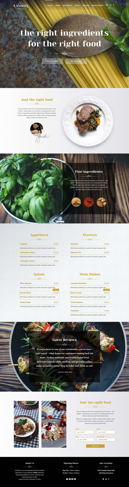
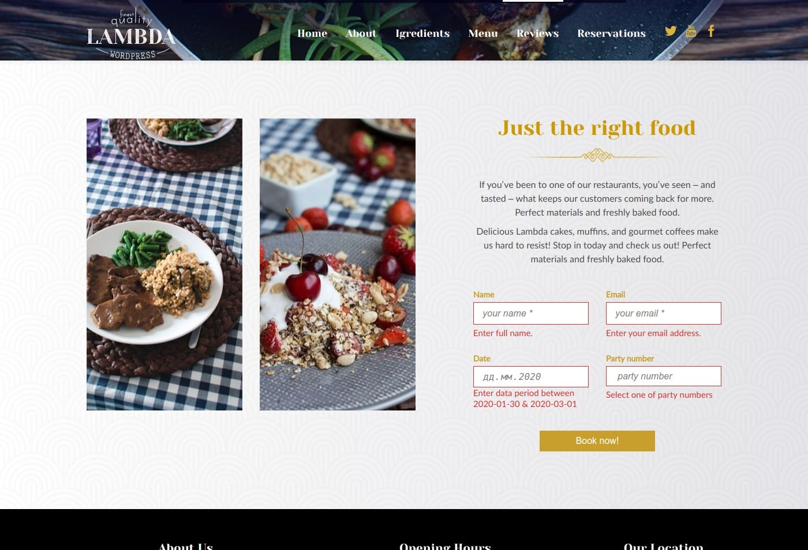
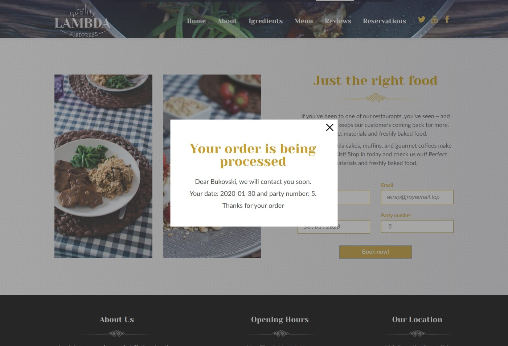
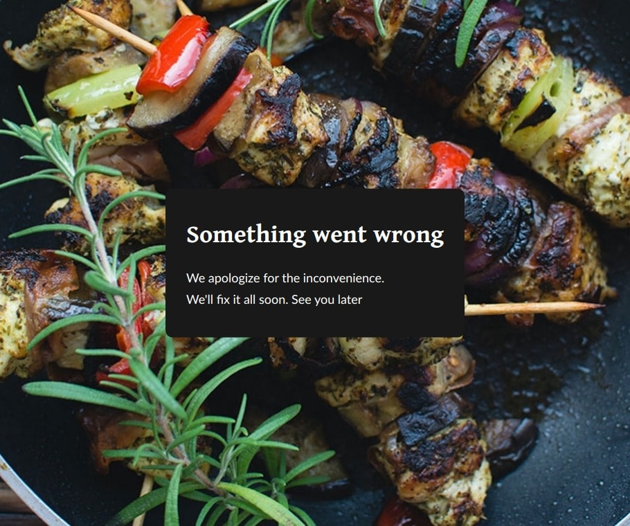

## React project "Food website"

- I use Sass for layout
> npm install sass-loader node-sass --save-dev
>
> for windows: npm install --unsafe-perm -g node-sass

- For props descriptions i use [prop-types](https://github.com/facebook/prop-types)

- For scroll the page when clicking on a menu item [react-scroll](https://github.com/fisshy/react-scroll)

- My input form uses a library to validate [validator.js](https://github.com/validatorjs/validator.js) 

- Animation of the appearance of blocks when scrolling a page [react-reveal](https://www.react-reveal.com/) 

- I was too lazy to make my preloader because I took ready [react-preloaders](https://github.com/VamOSGS/react-preloaders) 

